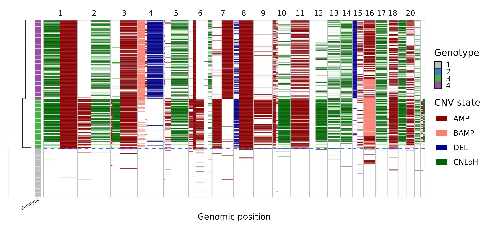
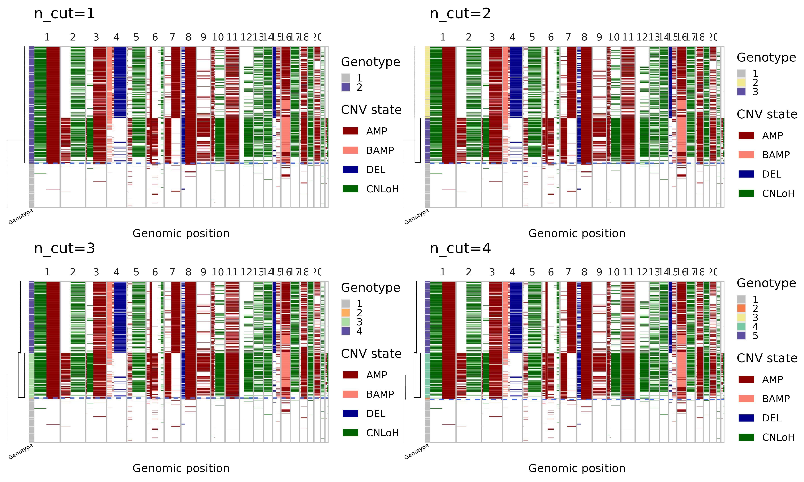
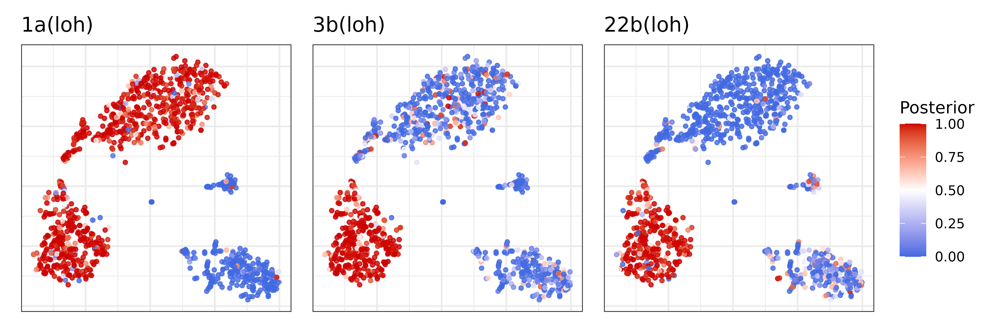
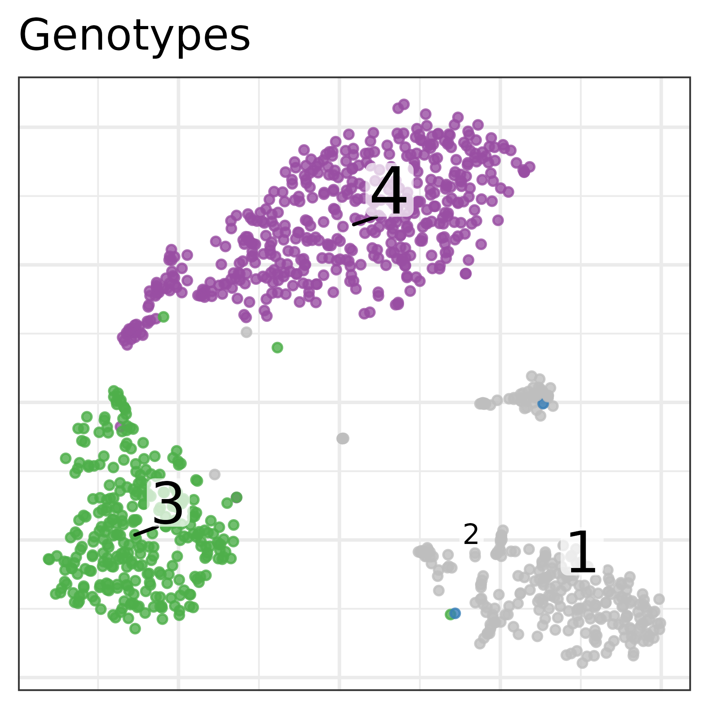
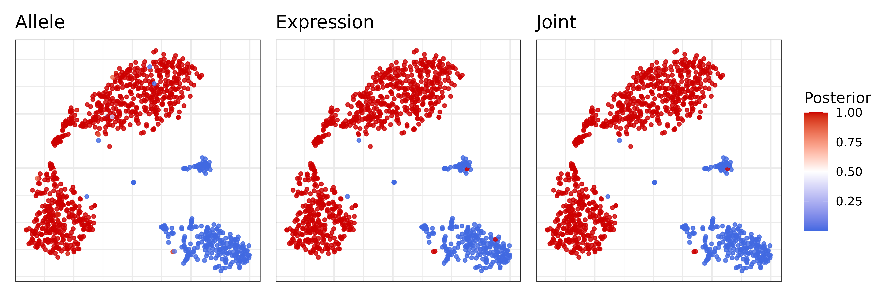
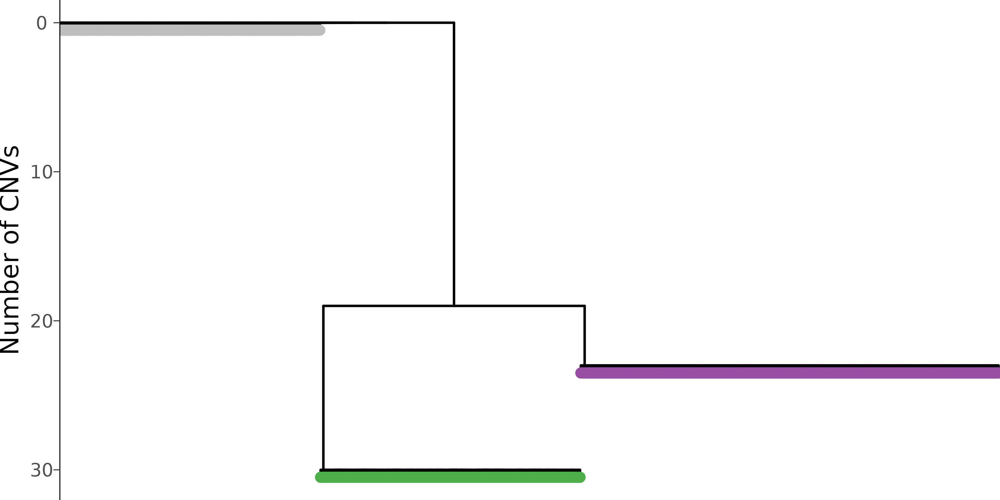
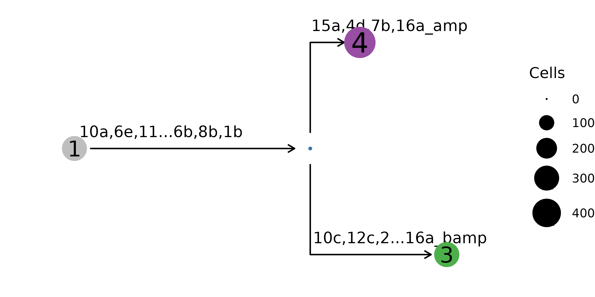

# Interpreting Numbat results

In this tutorial, we will illustrate how to visualize and interpret
Numbat output, using a triple-negative breast cancer dataset (TNBC1)
from [Gao et al](https://www.nature.com/articles/s41587-020-00795-2). We
will use [pagoda2](https://github.com/kharchenkolab/pagoda2) for
visualizing cells in low-dimensional expression space.

``` r
library(ggplot2)
library(numbat)
library(dplyr)
library(glue)
library(data.table)
library(ggtree)
library(stringr)
library(tidygraph)
library(patchwork)
```

After a Numbat run, we can summarize output files into a Numbat object:

``` r
nb = Numbat$new(out_dir = './numbat_out')
```

In this tutorial, let’s start the analysis with the pre-saved Numbat and
pagoda2 objects.

``` r
nb = readRDS(url('http://pklab.org/teng/data/nb_TNBC1.rds'))
pagoda = readRDS(url('http://pklab.org/teng/data/con_TNBC1.rds'))
```

## Copy number landscape and single-cell phylogeny

As an overview, we can visualize the CNV calls in single-cells and their
evolutionary relationships in an integrated plot panel:

``` r
mypal = c('1' = 'gray', '2' = "#377EB8", '3' = "#4DAF4A", '4' = "#984EA3")
  
nb$plot_phylo_heatmap(
  clone_bar = TRUE, 
  p_min = 0.9,
  pal_clone = mypal
)
```

 In this
visualization, the single-cell phylogeny (left) is juxtaposed with a
heatmap of single-cell CNV calls (right). The CNV calls are colored by
the type of alterations (AMP, amplification, BAMP, balanced
amplification, DEL, deletion, CNLoH, copy-neutral loss of
heterozygosity). The colorbar in-between differentiates the distinct
genetic populations (genotype). The dashed blue line separates the
predicted tumor versus normal cells. This tells us that the dataset
mainly consists of three cell populations, a normal population (gray)
and two tumor subclones (green and purple).

### Refine subclones on the phylogeny

Note that the number of subclones determined by the initial run
parameters in `run_numbat` can be re-adjusted using `nb$cutree()`:

``` r
plots = lapply(
    1:4,
    function(k) {
        nb$cutree(n_cut = k)
        nb$plot_phylo_heatmap() + ggtitle(paste0('n_cut=', k))
    }
)
```

``` r
wrap_plots(plots)
```



In `cutree` one can either specify `n_cut` or `max_cost`, which work
similarly as `k` and `h` in
[`stats::cutree`](https://rdrr.io/r/stats/cutree.html). Note that `n`
cuts should result in `n+1` clones (the top-level normal diploid clone
is always included). First cut should separate out the tumor cells as a
single clone, second cut gives two tumor subclones, and so on.
Alternatively, one can specify a `max_cost`, which is the maximum
likelihood cost threshold with which to reduce the phylogeny (higher
`max_cost` leads to fewer clones).

``` r
# restore to original number of cuts
nb$cutree(n_cut = 3)
```

After refining subclones in the phylogeny, you can recreate the clone
pseduobulk profiles and visualize them (see issue
[\#220](https://github.com/kharchenkolab/numbat/issues/220)).

## Consensus copy number segments

Let’s take a look at the consensus segments.

``` r
nb$plot_consensus()
```


## Bulk CNV profiles

We can also visualize these CNV events in pseudobulks where the data is
more rich, aggregating cells by clone:

``` r
nb$bulk_clones %>% 
  filter(n_cells > 50) %>%
  plot_bulks(
    min_LLR = 10, # filtering CNVs by evidence
    legend = TRUE
  )
```


## Single-cell CNV calls

Numbat probabilistically evaluates the presence/absence of CNVs in
single cells. The cell-level CNV posteriors are stored in the
`nb$joint_post` dataframe:

``` r
head(nb$joint_post) %>% select(cell, CHROM, seg, cnv_state, p_cnv, p_cnv_x, p_cnv_y)
```

    ##                        cell  CHROM    seg cnv_state        p_cnv     p_cnv_x
    ##                      <char> <fctr> <char>    <char>        <num>       <num>
    ## 1: TNBC1_AAACCTGCACCTTGTC-1      1     1b       amp 0.9999999997 1.000000000
    ## 2: TNBC1_AAACCTGCACCTTGTC-1      2     2a       amp 0.0002288397 0.001172894
    ## 3: TNBC1_AAACCTGCACCTTGTC-1      3     3a       amp 0.0522751360 0.052273344
    ## 4: TNBC1_AAACCTGCACCTTGTC-1      3     3c       amp 0.9147696618 0.982278728
    ## 5: TNBC1_AAACCTGCACCTTGTC-1      4     4b       amp 0.8999658266 0.845619643
    ## 6: TNBC1_AAACCTGCACCTTGTC-1      5     5a       amp 0.8070027725 0.778074328
    ##       p_cnv_y
    ##         <num>
    ## 1: 0.03844235
    ## 2: 0.09821435
    ## 3: 0.50000000
    ## 4: 0.10246769
    ## 5: 0.61862288
    ## 6: 0.53344303

which contains cell-level information on specific CNV segments (`seg`),
their alteration type (`cnv_state`), the joint posterior probability of
the CNV (`p_cnv`), the expression-based posterior (`p_cnv_x`), and the
allele-based posterior (`p_cnv_y`). We can visualize the event-specific
posteriors in a expression-based tSNE embedding:

``` r
plist = list()
muts = c('1a', '3b', '22b')
cnv_type = nb$joint_post %>% distinct(seg, cnv_state) %>% {setNames(.$cnv_state, .$seg)}
for (mut in muts) {
    
    plist[[mut]] = pagoda$plotEmbedding(
        alpha=0.8,
        size=1, 
        plot.na = F, 
        colors = nb$joint_post %>%
            filter(seg == mut) %>%
            {setNames(.$p_cnv, .$cell)},
        show.legend = T,
        mark.groups = F,
        plot.theme = theme_bw(),
        title = paste0(mut, '(', cnv_type[muts], ')')
    ) +
    scale_color_gradient2(low = 'royalblue', mid = 'white', high = 'red3', midpoint = 0.5, limits = c(0,1), name = 'Posterior')
}
wrap_plots(plist, guides = 'collect')
```



## Clonal assignments

Numbat aggregates signals across subclone-specific CNVs to
probabilistically assign cells to subclones. The information regarding
clonal assignments are contained in the `nb$clone_post` dataframe.

``` r
nb$clone_post %>% head() %>% select(cell, clone_opt, p_1, p_2, p_3, p_4)
```

    ##                       cell clone_opt           p_1          p_2          p_3
    ## 1 TNBC1_AAACCTGCACCTTGTC-1         4  1.162495e-72 2.105425e-20 3.478936e-29
    ## 2 TNBC1_AAACGGGAGTCCTCCT-1         1  1.000000e+00 5.814741e-51 5.920463e-95
    ## 3 TNBC1_AAACGGGTCCAGAGGA-1         4 2.434561e-100 2.175022e-14 2.085718e-30
    ## 4 TNBC1_AAAGATGCAGTTTACG-1         3  2.020088e-23 8.164920e-04 9.913458e-01
    ## 5 TNBC1_AAAGCAACAGGAATGC-1         4  9.546324e-64 4.989037e-11 1.657378e-31
    ## 6 TNBC1_AAAGCAATCGGAATCT-1         3  1.516589e-99 8.466806e-33 1.000000e+00
    ##            p_4
    ## 1 1.000000e+00
    ## 2 8.821034e-66
    ## 3 1.000000e+00
    ## 4 7.837745e-03
    ## 5 1.000000e+00
    ## 6 2.457592e-29

Here `clone_opt` denotes the maximum likelihood assignment of a cell to
a specific clone. `p_{1..4}` are the detailed breakdown of the posterior
probability that the cell belongs to each clone, respectively. Let’s
visualize the clonal decomposition in a tSNE embedding. Note that clone
1 is always the normal cells.

``` r
pagoda$plotEmbedding(
    alpha=0.8,
    size=1, 
    groups = nb$clone_post %>%
        {setNames(.$clone_opt, .$cell)},
    plot.na = F,
    plot.theme = theme_bw(),
    title = 'Genotypes',
    pal = mypal
)
```



## Tumor versus normal probability

Combining evidence from all CNVs, Numbat derives an aneuploidy
probability for each cell to distinguish tumor versus normal cells. We
can visualize the posterior aneuploidy probability based on expression
evidence only, allele evidence only, and jointly:

``` r
p_joint = pagoda$plotEmbedding(
    alpha=0.8,
    size=1, 
    colors = nb$clone_post %>%
        {setNames(.$p_cnv, .$cell)},
    plot.na = F,
    plot.theme = theme_bw(),
    title = 'Joint',
) +
scale_color_gradient2(low = 'royalblue', mid = 'white', high = 'red3', midpoint = 0.5, name = 'Posterior')
p_allele = pagoda$plotEmbedding(
    alpha=0.8,
    size=1, 
    colors = nb$clone_post %>%
        {setNames(.$p_cnv_x, .$cell)},
    plot.na = F,
    plot.theme = theme_bw(),
    title = 'Expression',
) +
scale_color_gradient2(low = 'royalblue', mid = 'white', high = 'red3', midpoint = 0.5, name = 'Posterior')
p_expr = pagoda$plotEmbedding(
    alpha=0.8,
    size=1, 
    colors = nb$clone_post %>%
        {setNames(.$p_cnv_y, .$cell)},
    plot.na = F,
    show.legend = T,
    plot.theme = theme_bw(),
    title = 'Allele',
) +
scale_color_gradient2(low = 'royalblue', mid = 'white', high = 'red3', midpoint = 0.5, name = 'Posterior')
(p_expr | p_allele | p_joint) + plot_layout(guides = 'collect')
```

 Both expression
and allele signal clearly separate the tumor and normal cells.

## Tumor phylogeny

Let’s take a closer look at the inferred single cell phylogeny and where
the mutations occurred.

``` r
nb$plot_sc_tree(
  label_size = 3, 
  branch_width = 0.5, 
  tip_length = 0.5,
  pal_clone = mypal, 
  tip = TRUE
)
```

 The mutational
history can also be represented on the clone level, where cells with the
same genotype are aggregated into one node.

``` r
nb$plot_mut_history(pal = mypal)
```


